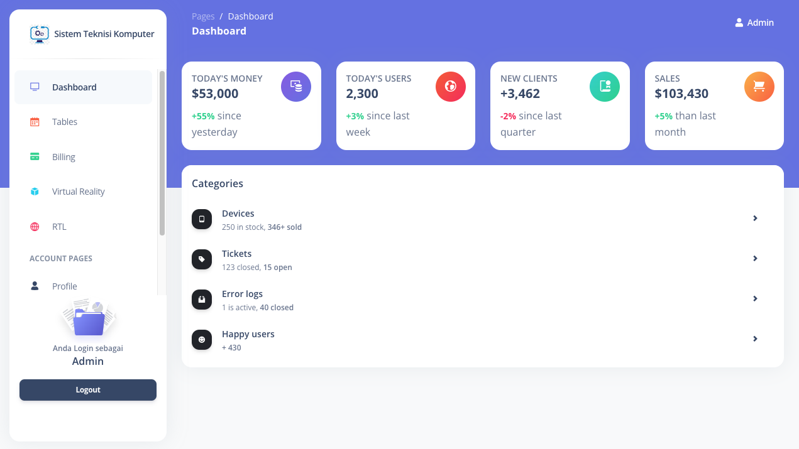
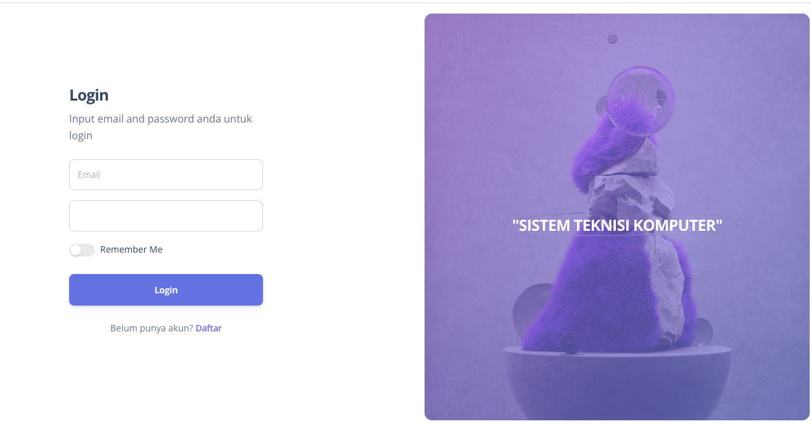
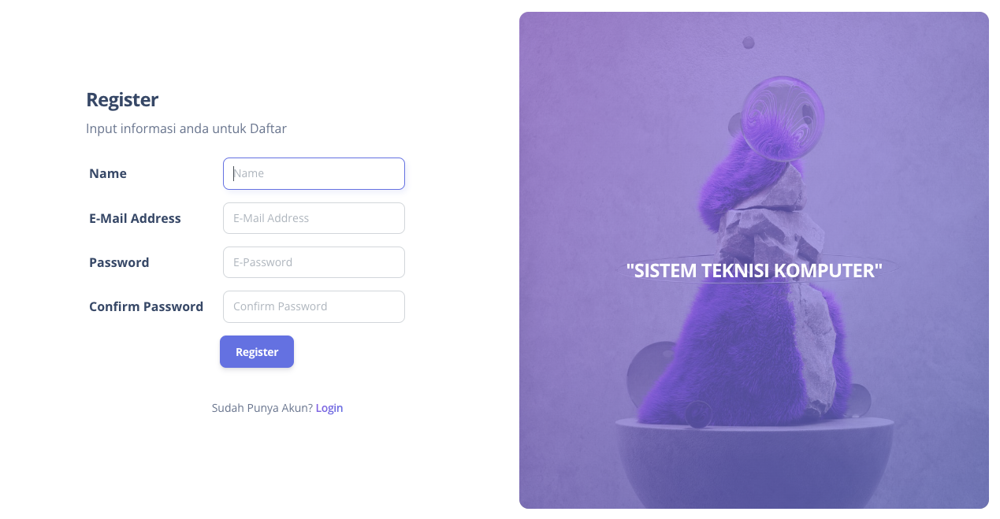

# Sistem
project Gita Talavial

## Sistem  Gita Talavial

### Features Role User

### Installation
1. Clone the repository using the command "git clone [link]"
2. Create database in MySql
3. Configure the .env file accordingly
4. Run command 

```
$composer install
$php artisan migrate
$php artisan db:seed
$php artisan serve
$php artisan storage:link
```
### Mendapat Update kodingan terbaru
```
$ git fetch origin master
$ git pull origin master
```
### Kirim perubahan coding di local
```
$ git add .
$ git commit -m "catatan perubahan"
$ git push -u origin master
```

### Built With
* Bootstrap- CSS framework
* JQuery- Javascript framework
* Laravel - PHP framework
* MySql- Databse

### Progress fitur 26/7/2023

## login 5 role
* Admin (done)
* Supervisor (done)


## halaman depan

* demo




